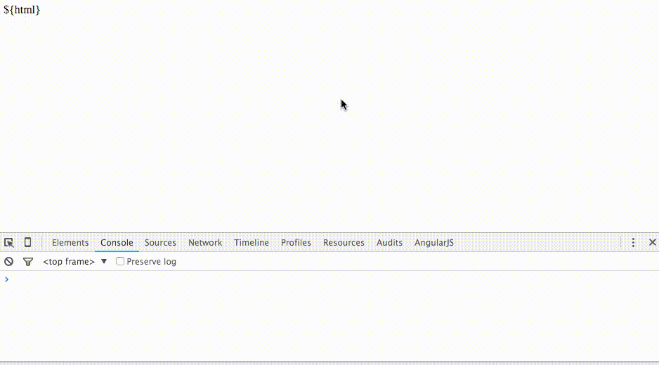

# rsr2-bug
Demo reproducing a redux-simple-router 2 bug.

## Preview


## Behavior
The `state.routing.location` key loses its value when the `state` is reset.

## Running
```bash
npm install
npm start
```
